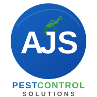

<p align="center">
  
</p>

<h1 align="center">AJS Pest Control Solutions</h1>

<p align="center">
  <strong>Bangalore's #1 Professional Pest Management Service</strong><br/>
  Safe · Certified · Guaranteed
</p>

<p align="center">
  <a href="https://react.dev"></a>
  <a href="https://vite.dev"></a>
  <a href="https://vercel.com"></a>
  
</p>

---

## 🏠 About

**AJS Pest Control Solutions** is the official website for a professional pest management company founded by **Jagadish Ayyappa**, serving homes and businesses across Bengaluru since 2009. The site showcases our services, expertise, and commitment to safe, eco-friendly pest control.

### Key Highlights

- 🏆 **10,000+** homes treated across Bangalore
- 📅 **15+ years** of industry experience
- ⭐ **4.9/5.0** rating on Google Reviews
- 🛡️ **ISO 9001:2015** certified & **PCAI** licensed

---

## 🚀 Tech Stack

| Technology | Purpose |
|------------|---------|
| **React 19** | Component-based UI |
| **Vite 8** | Lightning-fast build tool & dev server |
| **Vanilla CSS** | Custom styling with modern design patterns |
| **ESLint** | Code quality & linting |
| **Vercel** | Deployment & hosting |

---

## 📂 Project Structure

```
├── public/
│   ├── images/             # Hero, technician & service images
│   ├── favicon.svg         # Site favicon
│   ├── icons.svg           # SVG icon sprites
│   └── logo.svg            # AJS brand logo
├── src/
│   ├── assets/             # Static assets (images, SVGs)
│   ├── components/
│   │   ├── Navbar.jsx      # Navigation bar with mobile menu
│   │   ├── Hero.jsx        # Hero section with CTA & stats
│   │   ├── Marquee.jsx     # Scrolling trust badges
│   │   ├── Services.jsx    # Service cards grid (6 services)
│   │   ├── WhyUs.jsx       # Why choose AJS section
│   │   ├── Process.jsx     # Step-by-step process flow
│   │   ├── Testimonials.jsx# Customer reviews
│   │   ├── CtaBand.jsx     # Call-to-action banner
│   │   ├── Footer.jsx      # Footer with contact & links
│   │   ├── Logo.jsx        # Reusable logo component
│   │   └── ScrollReveal.jsx# Scroll animation wrapper
│   ├── App.jsx             # Root application component
│   ├── App.css             # Global app styles
│   ├── index.css           # CSS reset & variables
│   └── main.jsx            # React entry point
├── index.html              # Vite HTML entry point
├── vite.config.js          # Vite configuration
├── package.json            # Dependencies & scripts
└── .gitignore              # Git ignore rules
```

---

## 🛠️ Getting Started

### Prerequisites

- **Node.js** ≥ 18.x
- **npm** ≥ 9.x

### Installation

```bash
# Clone the repository
git clone https://github.com/AJSPEST2026/AJS_PEST_WEBSITE.git

# Navigate to the project
cd AJS_PEST_WEBSITE

# Install dependencies
npm install
```

### Development

```bash
# Start the dev server (default: http://localhost:5173)
npm run dev
```

### Build for Production

```bash
# Create optimized production build
npm run build

# Preview the production build locally
npm run preview
```

### Linting

```bash
# Run ESLint
npm run lint
```

---

## 🐛 Services Offered

| Service | Description |
|---------|-------------|
| 🪳 **Cockroach Control** | Gel bait & spray treatments for kitchens, bathrooms & drains |
| 🐜 **Termite Control** | Pre & post-construction anti-termite chemical barriers |
| 🦟 **Mosquito Control** | Fogging, larvicidal & residual spraying solutions |
| 🐀 **Rodent Management** | Bait stations, trapping & entry-point sealing |
| 🛏️ **Bed Bug Treatment** | Heat & chemical eradication from furniture & walls |
| 🏢 **Commercial AMC** | FSSAI-compliant contracts for offices, restaurants & hospitals |

---

## 🌍 Service Areas

Vijayanagar · Sanjeevininagar · Mudalapalya · Rajajinagar · Magadi Road · Basaveshwaranagar · and all of Bengaluru

---

## 📞 Contact

| Channel | Details |
|---------|---------|
| 📞 **Phone** | [+91 90354 93416](tel:+919035493416) · [+91 98444 94476](tel:+919844494476) |
| ✉️ **Email** | [ajspestcontrol147@gmail.com](mailto:ajspestcontrol147@gmail.com) |
| 📍 **Address** | #2043/C, 1st Main, 3rd Cross, Sanjeevininagar, Mudalapalya, Vijayanagar, Bengaluru – 560 072 |
| 🕐 **Hours** | Mon–Sat: 8AM – 8PM · Sun: 9AM – 5PM |

---

## 🚢 Deployment

This project is configured for **one-click deployment** on [Vercel](https://vercel.com):

1. Import this repository on [vercel.com/new](https://vercel.com/new)
2. Vercel auto-detects the **Vite** framework
3. No additional configuration needed — just click **Deploy**

---

## 📄 License

This is a **private project** for AJS Pest Control Solutions, Bengaluru. All rights reserved.

---

<p align="center">
  <sub>Built with ❤️ in Bengaluru · © 2024 AJS Pest Control Solutions</sub>
</p>
